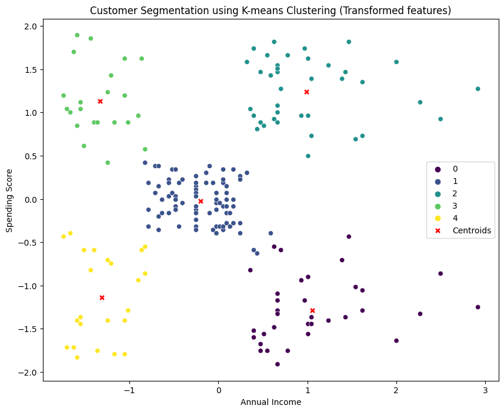
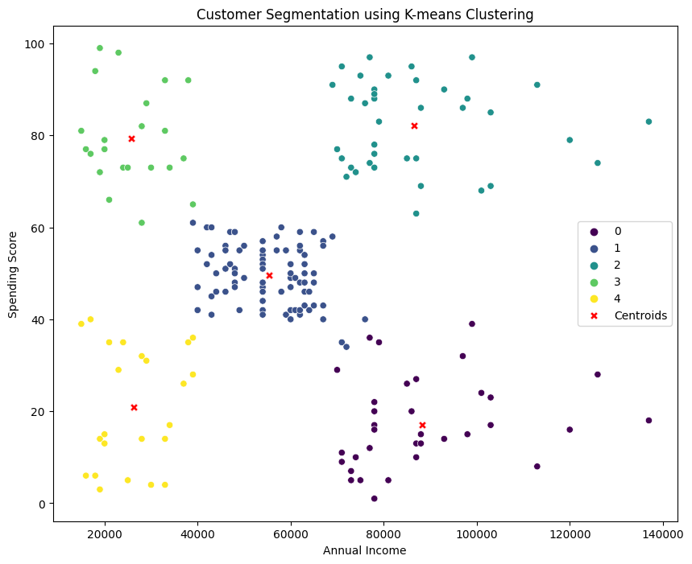
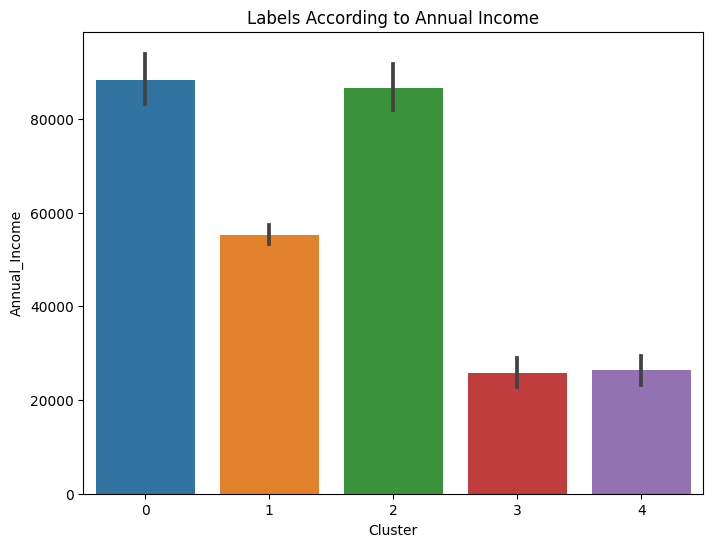

# Customer Segmentation using K-means Clustering

This project applies K-means clustering to segment customers based on their annual income and spending score. The analysis provides insights into different customer groups and their characteristics.

## Dataset

The dataset used in this project is sourced from [Mall Customers Dataset](https://www.kaggle.com/vjchoudhary7/customer-segmentation-tutorial-in-python). It includes information about customers' age, annual income, spending score, and gender.

## Features

- **Annual Income:** Represents the annual income of the customers.
- **Spending Score:** Indicates the spending behavior of customers.

## Clustering

The K-means clustering algorithm is employed to categorize customers into distinct segments. The optimal number of clusters (k) is determined using the elbow method.

## Visualization

### Scatter Plot (Transformed Features)

This plot shows the clustering of customers based on the transformed features (standardized annual income and spending score). The red X markers represent the centroids of each cluster.

### Scatter Plot (Original Features)

Here, the clustering is visualized using the original features. The centroids are transformed back to the original scale for better interpretability.

## Insights

Bar plots are included to illustrate the distribution of annual income and spending score within each cluster.

### Annual Income Distribution

### Spending Score Distribution

## Model Persistence

The trained K-means model is saved using the `pickle` library and can be loaded for future use.

import pickle

# Load the saved model
model_filename = 'kmeans_model.pkl'
with open(model_filename, 'rb') as model_file:
    loaded_kmeans_model = pickle.load(model_file)

Run the Jupyter Notebook or Python script:
python customer_segmentation.py

Feel free to explore and analyze the customer segmentation results!
